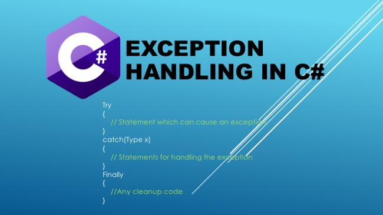

# 0x04. C# - Exceptions

# Resources
#### Read or watch:

* [Exceptions and Exception Handling](https://docs.microsoft.com/en-us/dotnet/csharp/programming-guide/exceptions/)
* [C# Exception Handling Best Practices](https://stackify.com/csharp-exception-handling-best-practices/)
* [Creating and Throwing Exceptions](https://docs.microsoft.com/en-us/dotnet/csharp/programming-guide/exceptions/creating-and-throwing-exceptions)
* [How to Execute Cleanup Code Using finally](https://docs.microsoft.com/en-us/dotnet/csharp/programming-guide/exceptions/how-to-execute-cleanup-code-using-finally)

## Learning Objectives

## General
* What are exceptions and when to use them
* What is the purpose of catching exceptions
* How to handle exceptions
* How to use try, catch, finally
* How to raise built-in exceptions
* When to implement clean-up actions after exceptions

## Requirements
### C# Tasks
* Allowed editors: Visual Studio Code.
* All files will be compiled on Ubuntu 14.04 LTS using dotnet.
* A README.md file, at the root of the folder of the project, is mandatory.
* All default C# files named Program.cs should be renamed to the name given in each task
* You do not need to know about namespaces and classes yet. Namespaces should be omitted in this project.
* Each C# task requires its own folder and .csproj file. Push all task folders to your Github and ensure the task names on the folders are correct.
* You do not need to push your obj/ or bin/ folders.
* In the following examples, the main.cs files are shown as examples. You can use them to test your functions, but you don’t have to push them to your repo (if you do we won’t take them into account). We will use our own main.cs files at compilation. Our main.cs files might be different from the one shown in the examples.

### Tasks

| **Filename** | **Description** |
|---|---|
| [0. Safe list printing](./0-safe_list_print/) | method that prints n elements of a list. |
| [1. Integer division](./1-divide_print/) | function that divides 2 integers and prints the result. |
| [2. Divide lists](./2-divide_lists/) | function that divides element by element 2 lists. |
| [3. Throw exception](./3-throw_exception/) | function that throws an ``Exception``  |
| [4. Throw exception with message ](./4-throw_exception_msg) | method that throws an ``Exception`` with a message  |

#### Follow me 💬

| Authors | GitHub | Twitter | Linkedin |
| :---: | :---: | :---: | :---: |
| Crispthofer Rincon | [crispthoalex](https://github.com/crispthoalex) | [@crispthoalex](https://twitter.com/crispthoalex) | [carmurrain](https://www.linkedin.com/in/carmurrain) |

### License
*`0x04. C# - Exceptions` is open source and therefore free to download and use without permission.*

##### Holberton School – Advanced Program – AR/VR
##### December, 2020. Cali, Colombia