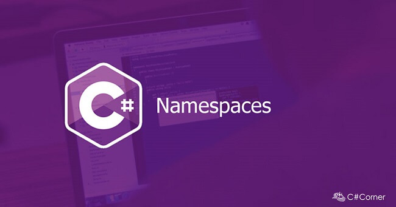

# 0x06. C# - Classes and Namespaces

# Resources
#### Read or watch:

* Object-Oriented Programming
* Classes and Structs
* Choosing Between Class and Struct
* C# Classes & OOP
* Properties vs. Fields
* ``.toString()`` method
* How to Override the .ToString() method
* Classes
* Objects
* Constructors
* Namespaces
* Using Properties
* ``this`` keyword
* .NET Stack and Heap
* Fundamentals of garbage collection

## Learning Objectives

## General

* How to document C# code with XML comments
* What is object-oriented programming?
* What is a namespace
* What is a class
* What are objects and instances
* What is the difference between a class and an object or instance
* What is a field
* What is a constructor
* What is a property
* How to use get and set
* When to use a constructor and when to use a property
* What is this and when to use it
* What is a method
* What are access modifiers
* What is a static class
* What is a static member
* What is encapsulation
* What is polymorphism
* What is abstraction
* What does toString do and how to override it
* What is the difference between a class and a struct
* When to use a class and when to use a struct
* What is garbage collection in C#

## Requirements
### C# Tasks
* Allowed editors: ``Visual Studio Code``.
* All files will be compiled on Ubuntu 14.04 LTS using ``dotnet``.
* A ``README.md`` file, at the root of the folder of the project, is mandatory.
* All default C# files named ``Program.cs`` should be renamed to the name given in each task
* Each C# task requires its own folder and .csproj file. Push all task folders to your Github and ensure the task names on the folders are correct.
* You do not need to push your ``obj/`` or ``bin/`` folders.
* In the following examples, the main.cs files are shown as examples. You can use them to test your functions, but you don’t have to push them to your repo (if you do we won’t take them into account). We will use our own main.cs files at compilation. Our main.cs files might be different from the one shown in the examples.
* All your public classes and their members should have XML documentation tags
* All your private classes and members should be documented but without XML documentation tags

# More Info

* Use [XML documentation comments](https://docs.microsoft.com/en-us/dotnet/csharp/codedoc)
* [XML Documentation Best Practices](https://blog.rsuter.com/best-practices-for-writing-xml-documentation-phrases-in-c/)
* All public types / classes and their members should be documented with ``
`` tags
* Private members should be documented but without XML comments
* To enable XML documentation in your project, you must add this line to the ``PropertyGroup`` in your ``.csproj`` file:
  * ``<DocumentationFile>bin\$(Configuration)\$(TargetFramework)\$(AssemblyName).xml</DocumentationFile>``
* Compiling your project with ``/doc`` will create an XML file in the directory specified above. With the ``.xml`` in the same directory as the compiled assembly, VSCode will automatically read the XML file and use it to provide tooltips with your documentation. Keep this in mind as you write your comments; they should give the programmer clear, concise information about your methods’ purpose and usage.

### Tasks

| **Filename** | **Description** |
|---|---|
| [0. Braaainsss](./0-enemy/) | Create a new namespace ``Enemies``. Create an empty public class ``Zombie`` within ``Enemies`` that defines a zombie. |
| [1. Healthy competition](./1-enemy/) |  write a public class ``Zombie`` that defines a zombie. |
| [2. Health validation](./2-enemy/) | write a public class ``Zombie`` that defines a zombie. |
| [3. Zombie health](./3-enemy/) | write a public class ``Zombie`` that defines a zombie. |
| [4. Hello, my name is](./4-enemy/) | write a public class ``Zombie`` that defines a zombie. |
| [5. Printing a zombie](./5-enemy/) | write a public class ``Zombie`` that defines a zombie. |

#### Follow me 💬

| Authors | GitHub | Twitter | Linkedin |
| :---: | :---: | :---: | :---: |
| Crispthofer Rincon | [crispthoalex](https://github.com/crispthoalex) | [@crispthoalex](https://twitter.com/crispthoalex) | [carmurrain](https://www.linkedin.com/in/carmurrain) |

### License
*`0x06. C# - Classes and Namespaces` is open source and therefore free to download and use without permission.*

##### Holberton School – Advanced Program – AR/VR
##### December, 2020. Cali, Colombia